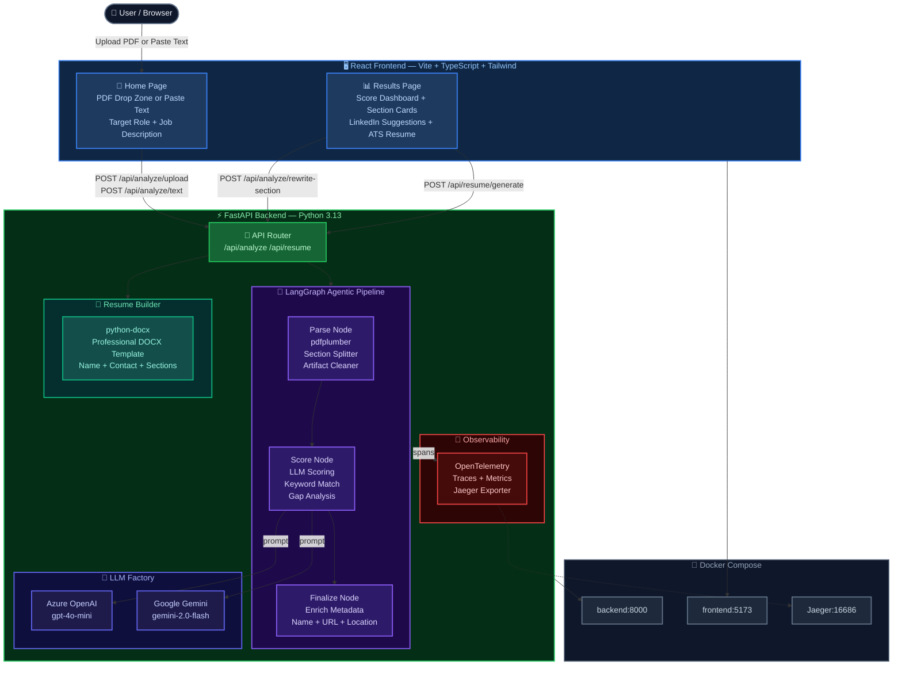

# ProfileScore — AI-Powered LinkedIn Profile Analyzer

> **Score your LinkedIn profile, get AI-rewritten sections, and download an ATS-optimized resume — all in under 60 seconds.**

    

---

## What is ProfileScore?

ProfileScore is an **enterprise-grade, full-stack AI application** that analyzes LinkedIn profiles and delivers:

- A **scored, graded breakdown** of every profile section (Headline, About, Experience, Skills, Certifications, Education)
- **AI-rewritten content** formatted for direct paste into LinkedIn
- **Keyword gap analysis** against a target job description
- A **downloadable ATS-optimized resume** (.docx or .txt) with a professional template

Built with a **LangGraph agentic pipeline**, dual LLM support (Azure OpenAI + Google Gemini), and OpenTelemetry observability — production-ready from day one.

---

## Key Features

| Feature | Description |
|---|---|
| 📄 **PDF / Text Upload** | Upload LinkedIn PDF export or paste raw profile text |
| 🎯 **Section Scoring** | AI scores Headline, About, Experience, Skills, Certifications, Education (0–100) |
| 📊 **Score Dashboard** | Animated gauge chart + radar chart + letter grade (A+ to F) |
| 🔍 **Gap Analysis** | What's working, what's not, and exactly how to fix it per section |
| 🔑 **Keyword Match** | Before/after keyword coverage score against target JD |
| ✍️ **LinkedIn Suggestions** | Copy-paste ready AI rewrites for every section with Regenerate button |
| 📥 **ATS Resume Download** | Professional .docx resume with name, contact, sections auto-filled |
| 🔄 **Multi-Provider LLM** | Swap between Azure OpenAI and Google Gemini via one env variable |
| 📡 **OpenTelemetry** | Distributed tracing + metrics (Jaeger-compatible, gracefully disabled) |
| 🐳 **Docker Ready** | One `docker compose up` runs everything |

---

## Business ROI

| Metric | Impact |
|---|---|
| ⏱️ **Time to profile update** | From hours of manual effort → under 5 minutes |
| 🎯 **Recruiter visibility** | Keyword-optimized profiles rank higher in LinkedIn search |
| 📈 **Interview callbacks** | ATS-optimized resumes pass automated screening filters |
| 💼 **Career coaching cost** | Replaces $150–500 professional resume/profile review services |
| 🏢 **Enterprise use case** | Bulk profile scoring for talent teams, L&D programs, internal mobility |

---

## Architecture



---

## Technology Stack

### Frontend
| Technology | Version | Purpose |
|---|---|---|
| React | 18 | UI framework |
| TypeScript | 5 | Type safety |
| Vite | 5 | Build tool / dev server |
| Tailwind CSS | 3 | Utility-first styling |
| Framer Motion | 11 | Animations |
| Recharts | 2 | Score charts / radar |
| React Router | 6 | Client-side routing |
| Axios | 1 | HTTP client |
| React Hot Toast | 2 | Notifications |
| Lucide React | — | Icon set |

### Backend
| Technology | Version | Purpose |
|---|---|---|
| Python | 3.13 | Runtime |
| FastAPI | 0.111+ | REST API framework |
| LangGraph | 0.2.x | Agentic pipeline orchestration |
| LangChain Core | 0.2.x | LLM abstraction layer |
| pdfplumber | 0.11+ | LinkedIn PDF text extraction |
| openai | 1.35+ | Azure OpenAI client |
| google-genai | 1.0+ | Google Gemini client |
| python-docx | — | ATS resume .docx generation |
| httpx | — | Async HTTP with SSL bypass |
| structlog | — | Structured JSON logging |
| pydantic-settings | 2 | Environment config |
| OpenTelemetry | 1.24+ | Distributed tracing + metrics |

### Infrastructure
| Technology | Purpose |
|---|---|
| Docker + Compose | Container orchestration |
| Nginx | Frontend static file serving |
| Jaeger | Distributed trace visualization |

---

## Project Structure

```
ProfileScore/
├── backend/
│   ├── app/
│   │   ├── agents/
│   │   │   └── graph.py          # LangGraph pipeline (parse→score→finalize)
│   │   ├── api/routes/
│   │   │   ├── analyze.py        # /analyze endpoints + SECTION_REWRITE_PROMPTS
│   │   │   └── resume.py         # /resume/generate + professional DOCX builder
│   │   ├── core/
│   │   │   ├── config.py         # pydantic-settings, reads .env
│   │   │   ├── logging.py        # structlog JSON logger
│   │   │   └── telemetry.py      # OpenTelemetry setup (guarded by OTEL_ENABLED)
│   │   ├── models/
│   │   │   └── schemas.py        # Pydantic models (ProfileAnalysis, SectionFeedback)
│   │   ├── services/
│   │   │   ├── llm_service.py    # Multi-provider LLM factory (Azure / Gemini)
│   │   │   └── pdf_parser.py     # PDF text extraction + section splitter + artifact cleaner
│   │   └── main.py               # FastAPI app entry point
│   ├── requirements.txt
│   ├── Dockerfile
│   └── start.ps1                 # Windows dev launcher
├── frontend/
│   ├── src/
│   │   ├── api/client.ts         # Axios API calls
│   │   ├── components/
│   │   │   ├── ScoreDashboard.tsx    # Gauge + radar charts
│   │   │   ├── SectionCard.tsx       # Expandable section feedback cards
│   │   │   ├── SuggestionBlock.tsx   # LinkedIn copy-paste blocks + Regenerate
│   │   │   └── UploadSection.tsx     # PDF drop zone + text paste + options panel
│   │   ├── pages/
│   │   │   ├── Home.tsx          # Upload form
│   │   │   └── Results.tsx       # Full results page
│   │   └── types/profile.ts      # TypeScript interfaces
│   ├── Dockerfile
│   └── nginx.conf
├── docker-compose.yml
├── .env.example
└── .gitignore
```

---

## Developer Guide

### Prerequisites

- Python 3.11+ (3.13 recommended)
- Node.js 18+
- Docker Desktop (optional, for containerized run)
- An Azure OpenAI **or** Google Gemini API key

---

### 1. Clone the Repository

```bash
git clone https://github.com/nsureshmanikandan/ProfileScore.git
cd ProfileScore
```

---

### 2. Backend Setup

```bash
cd backend

# Create virtual environment
python -m venv .venv

# Activate (Windows)
.venv\Scripts\activate

# Activate (Mac/Linux)
source .venv/bin/activate

# Install dependencies
pip install -r requirements.txt
```

**Configure environment:**

```bash
# Copy the example and fill in your keys
cp ../.env.example .env
```

Edit `backend/.env`:

```env
# Choose your LLM provider
LLM_PROVIDER=gemini           # or "azure"

# Azure OpenAI (if using azure)
AZURE_OPENAI_API_KEY=your_key_here
AZURE_OPENAI_ENDPOINT=https://<resource>.openai.azure.com/
AZURE_OPENAI_DEPLOYMENT=gpt-4o-mini
AZURE_OPENAI_API_VERSION=2024-12-01-preview

# Google Gemini (if using gemini)
GEMINI_API_KEY=your_gemini_key_here
GEMINI_MODEL=gemini-2.0-flash

# Observability (set false if Jaeger not running)
OTEL_ENABLED=false
LOG_LEVEL=INFO
```

**Start the backend:**

```bash
# Windows
.\.venv\Scripts\python -m uvicorn app.main:app --reload --port 8000

# Mac/Linux
.venv/bin/uvicorn app.main:app --reload --port 8000
```

Backend runs at `http://localhost:8000` · API docs at `http://localhost:8000/docs`

---

### 3. Frontend Setup

```bash
cd frontend
npm install
npm run dev
```

Frontend runs at `http://localhost:5173`

---

### 4. Run with Docker Compose

```bash
# From project root
docker compose up --build
```

| Service | URL |
|---|---|
| Frontend | http://localhost:5173 |
| Backend API | http://localhost:8000 |
| API Docs (Swagger) | http://localhost:8000/docs |
| Jaeger Tracing UI | http://localhost:16686 |

> **Note:** Copy `.env.example` to `backend/.env` and fill in your API keys before running Docker Compose.

---

### 5. LLM Provider Switching

Switch providers without changing any code — just update `.env`:

```env
# Use Google Gemini
LLM_PROVIDER=gemini
GEMINI_API_KEY=your_key

# Use Azure OpenAI
LLM_PROVIDER=azure
AZURE_OPENAI_API_KEY=your_key
AZURE_OPENAI_ENDPOINT=https://your-resource.openai.azure.com/
```

---

### 6. Corporate Proxy / SSL Issues

If behind a corporate proxy with SSL inspection (e.g., Accenture, enterprise networks):

```env
# In backend/.env — disables SSL verification for LLM API calls
SSL_VERIFY=false
```

---

### 7. API Reference

| Method | Endpoint | Description |
|---|---|---|
| `POST` | `/api/analyze/upload` | Analyze LinkedIn PDF (multipart) |
| `POST` | `/api/analyze/text` | Analyze pasted profile text |
| `POST` | `/api/analyze/rewrite-section` | Regenerate one section's suggestion |
| `POST` | `/api/resume/generate` | Download ATS resume (.docx or .txt) |
| `GET` | `/health` | Health check |

---

### 8. Observability

Enable full distributed tracing with Jaeger:

```env
OTEL_ENABLED=true
OTEL_EXPORTER_OTLP_ENDPOINT=http://localhost:4317
OTEL_SERVICE_NAME=profilescore-backend
```

Start Jaeger via Docker:

```bash
docker run -d --name jaeger \
  -p 16686:16686 -p 4317:4317 \
  jaegertracing/all-in-one:latest
```

View traces at `http://localhost:16686`.

---

## Contributing

1. Fork the repository
2. Create a feature branch: `git checkout -b feature/your-feature`
3. Commit your changes: `git commit -m "Add your feature"`
4. Push to the branch: `git push origin feature/your-feature`
5. Open a Pull Request

---

## License

MIT License — see [LICENSE](LICENSE) for details.

---

<div align="center">
  Built with ❤️ using FastAPI · LangGraph · React · Azure OpenAI · Google Gemini
</div>
